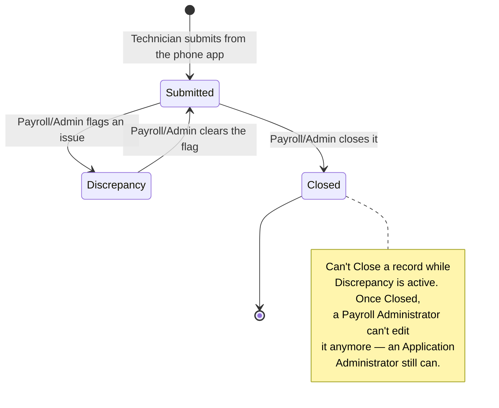
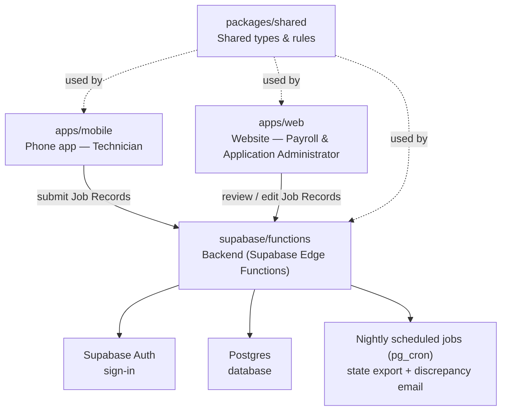

# Welcome to LiveOakv3!

This guide will help you get started. It is written in plain, simple language so anyone can follow it — even if you are new to coding.

---

## 1. What Is This App?

LiveOakv3 helps a company track work that field workers do. Think of it like a digital paper form, but smarter.

- A field worker finishes a job (like installing something at an address).
- They open the app on their phone and fill out a short form: the address, how much work they did, and some photos.
- That form gets saved. Office staff then check it, fix mistakes, and use it to pay the field worker correctly.

There is a **phone app** (for field workers) and a **web app** (for office staff).

---

## 2. Who Uses the App?

The app has three kinds of users. One person can have more than one role.

| Role | What They Do |
|---|---|
| **Technician** | Goes out into the field and submits a **Job Record** using the phone app. Once they submit it, they cannot change it. They can only look at their own past submissions. |
| **Payroll Administrator** | Checks Job Records for mistakes (wrong address, wrong footage, etc.) and fixes them before payday. |
| **Application Administrator** | Manages who is allowed to use the app and what role they have. Can edit any Job Record, even ones a Payroll Administrator already touched. |

---

## 3. Words You Will See a Lot

The project uses specific words on purpose, so everyone means the same thing. Try to use these same words when you talk about the app.

- **Job Record** — One finished piece of field work. It has an address, a work code, footage, photos, and notes. (Don't call it a "job" or a "ticket.")
- **Job ID** — A note the Technician types in by hand, referring to an outside system. It doesn't have to be unique.
- **Record ID** — The real, unique ID the app creates for each Job Record. This is the one used to look things up.
- **Footage** — A whole number, measured in feet, that the Technician enters.
- **Discrepancy** — A flag that means "something looks wrong with this record." An admin sets it, along with a reason. It gets cleared once fixed.
- **Closed** — A flag that means payroll is done processing this record. A record can't be Closed while it still has an open Discrepancy.
- **Duplicate** — Two Job Records that look like the same job (same address, submitted within 6 months of each other). The app flags these automatically. One is marked as the "primary" (the one that gets paid); admins can change which one that is.

For the full list, see [`CONTEXT.md`](./CONTEXT.md) in the root of the project.

Here's what happens to a Job Record after it's submitted:



A Technician can only ever see this happen from the outside — once they submit, the record belongs to Payroll and Application Administrators. (Separately, a **Duplicate** flag can attach to a record at any point along this path — it's detected automatically, not part of this status flow.)

---

## 4. How the Code Is Organized

This project is a **monorepo** — that means several related pieces of software live together in one place. Here's a map:

```
LiveOakv3/
├── apps/
│   ├── web/        ← The website office staff use (built with React)
│   └── mobile/     ← The phone app field workers use (built with Expo/React Native)
├── packages/
│   └── shared/     ← Code and rules shared by everything above (e.g. what a "role" is)
├── functions/      ← Backend business logic (Job Records, users, notifications) — used
│                      directly, unchanged, by the Edge Functions in supabase/functions/
├── supabase/       ← The backend that actually runs in the cloud: Postgres migrations
│                      (supabase/migrations/), Edge Functions (supabase/functions/), and
│                      local-stack config (config.toml)
├── docs/
│   ├── adr/        ← Short write-ups explaining big decisions and why we made them
│   └── agents/     ← Notes for AI coding assistants working in this repo
└── CONTEXT.md      ← The glossary of words this project uses (see section 3)
```

You'll also see `firebase.json`, `.firebaserc`, `firestore.rules`, and
`firestore.indexes.json` at the root. Those are leftovers from the app's original Firebase
backend — nothing in the running app uses them anymore now that everything is on Supabase,
and they're slated for removal. Don't take them as a sign of what the backend runs on
today.

**A simple way to think about it:** the phone app and website are the two "front doors."
`supabase/functions/` (the Edge Functions) is the "back office" that both front doors talk
to, and it leans on the business logic in `functions/src/` — imported directly, unchanged —
to actually do the work. The `shared` package is a toolbox both front doors and the back
office use, so they don't repeat themselves.



The phone app and website never talk to the database directly — everything goes through
the Supabase Edge Functions in `supabase/functions/`, which check who you are and what role
you have before touching any data.

---

## 5. What This App Is Built On

You don't need to be an expert in these to get started, but here's what's involved:

- **TypeScript** — the programming language used everywhere in this project. It's JavaScript with extra safety checks.
- **React** — powers the web app.
- **Expo / React Native** — powers the phone app.
- **Supabase** — the cloud platform this app runs on. It handles:
  - **Auth** — signing people in with a company Google account
  - **Postgres** — the database that stores Job Records and users (access is locked down
    with row-level security, so the database itself refuses queries from anyone who
    isn't going through the backend)
  - **Edge Functions** — backend code (small TypeScript/Deno functions), plus jobs that
    run automatically every night via `pg_cron`
- **Vite** — the tool that runs and builds the web app.
- **Vitest** — the tool that runs automated tests.

If you want to know *why* we picked these tools, read the short files in `docs/adr/`. Each one explains a decision in a few sentences.

---

## 6. Setting Up Your Computer

### What you need first

1. **Node.js, version 20** — this is the engine that runs JavaScript/TypeScript outside a browser. Download it from [nodejs.org](https://nodejs.org) if you don't have it.
2. **Git** — to download (clone) the project and save your changes.
3. **Docker** — only needed if you want to run the app fully offline using the Supabase CLI's local stack (a set of Docker containers standing in for the real cloud: database, auth, backend functions). Most people will want this.
4. **The Expo Go app** on your phone, or a phone simulator on your computer — only needed if you want to test the mobile app.

### Steps

1. Download the project:
   ```bash
   git clone https://github.com/fluffygeek/LiveOakv3.git
   cd LiveOakv3
   ```
2. Install all the code packages the project depends on:
   ```bash
   npm install
   ```
   This one command installs everything for the web app, the mobile app, the backend, and the shared package all at once — that's what "workspaces" means in `package.json`.

---

## 7. Running the App on Your Computer

To try out the full app without touching any real, live data, use the **Supabase CLI's
local stack** — a safe, local stand-in for the real cloud, running as Docker containers.

Open a few terminal windows and run these, in order:

```bash
# Terminal 1: build the shared toolbox (apps/web and apps/mobile both import its
# compiled output, so this has to happen before you run either app)
npm run build --workspace=packages/shared

# Terminal 2: start the local Supabase stack (Postgres, auth, backend functions, all in Docker)
npx supabase start

# Terminal 3: start the website
npm run dev --workspace=apps/web
```

`apps/web/.env` also needs a `VITE_SUPABASE_ANON_KEY` value, read from `npx supabase
status` after `supabase start` finishes — unlike the old Firebase setup, there's no safe
placeholder default, so the app won't be able to talk to auth/data without it. Full
step-by-step details (including the equivalent env var for the mobile app) are in
[`docs/deploy-demo.md`](./docs/deploy-demo.md).

Then open **http://localhost:5173** in your browser to see the web app.

To run the phone app instead:
```bash
npm run start --workspace=apps/mobile
```
Then scan the QR code with the Expo Go app on your phone.

**Good to know:** the very first time, no one is an "Application Administrator" yet, so no one can invite anyone else. The full steps to create that first admin account by hand are in [`docs/deploy-demo.md`](./docs/deploy-demo.md) — look for "Bootstrapping the first admin."

---

## 8. Running Tests and Checks

Before you consider your work finished, run these from the project root:

```bash
npm run typecheck   # checks that your code's types make sense
npm run test        # runs all the automated tests
npm run build        # makes sure everything actually compiles
```

Each of these runs across every part of the project at once (web, mobile, backend, shared) —
except the Edge Functions in `supabase/functions/`, which are Deno code, not part of the
npm workspaces above. Those have their own commands, and need the [Deno
CLI](https://deno.com) installed:

```bash
npm run typecheck:edge-functions
npm run test:edge-functions
```

---

## 9. Things That Are Not Finished Yet

This project is still being built. A few pieces are stubbed out on purpose — they don't crash, they just don't do the real thing yet:

- **Photos upload, but office staff can't actually view them yet.** Submitting a Job Record from the phone app uploads its photos to Supabase Storage for real — but the web app's review screen only shows how many photos are attached, not the photos themselves.
- **Address checking always says "not verified."** The real address-checking service isn't hooked up yet.
- **The nightly "something's wrong" email doesn't actually send.** The code that would send it runs, but nothing goes out.

Knowing this will save you time — if you see one of these while testing, it's expected, not a bug.

---

## 10. How Work Gets Tracked

- Work items live in **GitHub Issues** on this repo (`fluffygeek/LiveOakv3`).
- Issues get labeled to show their status, for example: `needs-triage`, `needs-info`, `ready-for-agent`, `ready-for-human`, `wontfix`.
- More detail is in [`docs/agents/issue-tracker.md`](./docs/agents/issue-tracker.md) and [`docs/agents/triage-labels.md`](./docs/agents/triage-labels.md).

---

## 11. Where to Look Next

| I want to... | Look here |
|---|---|
| Understand a word used in the app | [`CONTEXT.md`](./CONTEXT.md) |
| Understand *why* a big decision was made | [`docs/adr/`](./docs/adr/) |
| Run a full demo, including on a real (not fake) server | [`docs/deploy-demo.md`](./docs/deploy-demo.md) |
| See how work items are tracked | [`docs/agents/issue-tracker.md`](./docs/agents/issue-tracker.md) |
| See the phone app's code | [`apps/mobile/src/`](./apps/mobile/src/) |
| See the website's code | [`apps/web/src/`](./apps/web/src/) |
| See the Edge Functions (what actually runs in the cloud) | [`supabase/functions/`](./supabase/functions/) |
| See the backend business logic those functions call into | [`functions/src/`](./functions/src/) |
| See code shared everywhere | [`packages/shared/src/`](./packages/shared/src/) |

Welcome aboard — if something in this guide is confusing or out of date, that's worth fixing. Open an issue or update this file.
