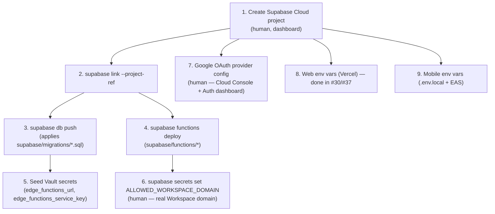

# Production deploy runbook (Supabase)

The real, cloud-hosted counterpart to [`deploy-demo.md`](./deploy-demo.md)'s local Docker
stack. Tracked as #37 ("Provision production Supabase project"), the production-infra
sibling of #30 (Hosting). Provisioning the Supabase account/project and configuring Google
OAuth credentials are steps only a human with account access can do — this doc marks those
clearly. Everything else here was run and verified live against the real project as of
2026-08-17.



## Prerequisites

- The `supabase` CLI, invoked via `npx supabase` (root `devDependencies`, no separate
  install). Verified: `npx supabase --version` → `2.114.0`.
- Docker Desktop running, for `supabase functions deploy`'s local-bundling path (see
  [Known gaps](#known-gaps-worth-disclosing) — the alternative `--use-api` server-side
  bundler doesn't work for this repo's function set). Verified: `docker --version` →
  29.7.2, `docker info` reachable.
- The CLI must already be authenticated (`~/.supabase` config — `supabase login` once,
  interactively, outside of any agent session; an agent cannot complete an OAuth login
  flow itself).

## 1. Create the Supabase Cloud project (human)

Dashboard → New Project. Choose a region deliberately (this project used `us-east-1`,
matching where the rest of the infra — Vercel, etc. — lives), not whatever the dashboard
defaults to. Note the project ref (`https://<ref>.supabase.co`) — everything below uses
it.

**For this repo**, this step is already done: project `LiveOak`, ref
`clnfwizexjwdrxonsnwx`, region `us-east-1`, status `ACTIVE_HEALTHY`.

## 2. Link the CLI to the project

```bash
npx supabase link --project-ref <project-ref>
```

May prompt for the database password (set at project creation) — if you don't have it,
the project owner can reset it from Dashboard → Project Settings → Database. Verify with:

```bash
npx supabase projects list   # linked: true against your project ref
```

**Verified live**: `link` succeeded with no password prompt for this project — recent
CLI versions authenticate the direct DB connection through the Management API access
token instead of requiring the DB password interactively. If a future project/CLI
combination does prompt and the password isn't available, skip to step 4
(`functions deploy` doesn't require the DB link).

## 3. Push migrations

```bash
npx supabase db push --linked --yes
```

Applies every file in `supabase/migrations/*.sql`, in order, to the linked project. This
is the deploy path for every migration ticket adds from here on (#18 users table, #21 job
records, #23 audit log, #28 state exports, etc.) — always additive, never destructive; do
not run `db reset` against a real project.

**Verified live**: all 4 current migrations applied cleanly to a brand-new empty project —
`20260814194632_scheduling_infra.sql`, `20260814210000_users_table.sql`,
`20260814220000_job_records_table.sql`, `20260814230000_state_exports_table.sql`.
Confirm with:

```bash
npx supabase migration list --linked
# local and remote timestamps should match for every migration
```

## 4. Deploy Edge Functions

```bash
# build the shared workspace package first -- ping and scheduled-ping import its
# compiled dist/ output, not the TS source, and dist/ isn't committed
npm run build --workspace=packages/shared

npx supabase functions deploy <function-name> --project-ref <project-ref>
```

Deploy each function individually (see [Known gaps](#known-gaps-worth-disclosing) for why
a single `supabase functions deploy` with no function name — deploy-all — doesn't work
today). The 13 functions under `supabase/functions/` are: `createJobRecord`,
`getJobRecord`, `inviteUser`, `listJobRecords`, `listMyWeeklyJobRecords`, `listUsers`,
`nightlyStateExport`, `ping`, `resolveMyAccess`, `revokeUser`,
`setDistributionListMembership`, `scheduled-ping`, `updateUserRoles`.

**Verified live**: `ping` and `scheduled-ping` deployed successfully (`supabase functions
list --project-ref <ref>` shows both `ACTIVE`, dashboard reachable at
`https://supabase.com/dashboard/project/<ref>/functions`). **The other 11 are currently
blocked** — see [Known gaps](#known-gaps-worth-disclosing).

## 5. Seed the Vault scheduling secrets

The scheduling harness (#17, reused by #27/#28) reads two secrets from **Supabase Vault**
(not Edge Function env vars — a separate mechanism) at cron-invocation time, per
`supabase/migrations/20260814194632_scheduling_infra.sql` and
`supabase/seed.sql`'s comment. This is real per-project data (a live `service_role` key),
so run it yourself — don't have an agent fetch or paste a real key into any file or chat
that gets logged/committed.

Get the project's URL and `service_role` key from Dashboard → Project Settings → API (or
`npx supabase projects api-keys --project-ref <project-ref> --reveal`, run locally by a
human — this repo's agent classifier blocks agents from revealing secret API keys, by
design). Then, via the Dashboard's SQL Editor (or `npx supabase db query --linked -f
seed.sql` with a local, uncommitted file):

```sql
select vault.create_secret('https://<project-ref>.supabase.co/functions/v1', 'edge_functions_url');
select vault.create_secret('<real service_role key>', 'edge_functions_service_key');
```

Idempotent note: `vault.create_secret` errors on a duplicate `name` — use
`vault.update_secret(id, new_secret)` (look up `id` via `select id from vault.secrets
where name = '...'`) to rotate an existing value instead of re-creating it.

**Not yet done for the real project** — needs a human with dashboard access, per above.

## 6. Set `ALLOWED_WORKSPACE_DOMAIN`

The Google Workspace domain allowed to sign in (`resolveMyAccess`, `ping`,
`resolvedAccessHandler.ts` all read this; defaults to `"example.com"` if unset — the repo
has no safe production default). Set it as an Edge Function secret:

```bash
npx supabase secrets set ALLOWED_WORKSPACE_DOMAIN=<real-workspace-domain> --project-ref <project-ref>
```

**Not yet done** — needs the real Workspace domain, which only the project owner knows.

## 7. Configure the Google OAuth provider (human-only)

Two linked pieces, both outside CLI/API reach for an agent:

1. **Google Cloud Console** — create an OAuth 2.0 Client ID (Web application type) under
   the org's Google Cloud project. Authorized redirect URI:
   `https://<project-ref>.supabase.co/auth/v1/callback`. If Workspace-only sign-in is
   required, configure the OAuth consent screen's user type accordingly.
2. **Supabase Dashboard** → Authentication → Providers → Google — paste the Client ID and
   Client Secret from step 1, enable the provider.

Once both are done, `supabase.auth.signInWithOAuth({ provider: 'google' })` (already
called from `apps/web`/`apps/mobile`) will complete against the real project.

**Not yet done** — needs a human with Google Cloud Console + Supabase Dashboard access.

## 8. Web env vars (Vercel) — already done

`apps/web`'s Vercel project (`dark-side-technologies/liveoakv3-web`, from #30) already has
`VITE_SUPABASE_URL` and `VITE_SUPABASE_ANON_KEY` set for Production/Preview/Development,
pointing at the real project. Reproduced here for completeness:

```bash
vercel env add VITE_SUPABASE_URL production preview development
# value: https://<project-ref>.supabase.co
vercel env add VITE_SUPABASE_ANON_KEY production preview development
# value: <anon/publishable key, from Dashboard -> Project Settings -> API>
```

## 9. Mobile env vars

`apps/mobile/src/supabase.ts` reads `EXPO_PUBLIC_SUPABASE_URL` and
`EXPO_PUBLIC_SUPABASE_ANON_KEY` (no safe default for the anon key — same caveat as the
web app, see `deploy-demo.md`).

**Local Expo dev** — `apps/mobile/.env.local` (gitignored via the root `.gitignore`'s
`.env*` pattern; verified with `git check-ignore -v apps/mobile/.env.local`) is already
seeded for this project:

```
EXPO_PUBLIC_SUPABASE_URL=https://<project-ref>.supabase.co
EXPO_PUBLIC_SUPABASE_ANON_KEY=<anon/publishable key>
```

**EAS builds** — mobile ships via EAS, not Vercel, and there's no `eas.json` or EAS
project configured yet in this repo. The `eas` CLI isn't installed/authenticated in this
environment either (`Get-Command eas` finds nothing). Once EAS is set up
(`npx eas-cli init`), the build-time equivalent of the two vars above is:

```bash
npx eas-cli env:create --scope project --name EXPO_PUBLIC_SUPABASE_URL \
  --value https://<project-ref>.supabase.co --environment production --visibility plaintext
npx eas-cli env:create --scope project --name EXPO_PUBLIC_SUPABASE_ANON_KEY \
  --value <anon/publishable key> --environment production --visibility plaintext
```

(`EXPO_PUBLIC_*` vars are baked into the client bundle by design, so `--visibility
plaintext` is correct here — they're not secrets. Repeat with `--environment preview` /
`development` as needed, or use the older `eas secret:create` if the project is pinned to
a `classic` EAS env config instead of the newer `environment` model.)

**Not yet done** — needs a human to run `eas login` / `eas-cli init` and decide on the EAS
project setup; not attempted here.

## Known gaps, worth disclosing

- **11 of 13 Edge Functions fail to deploy in this environment — a CLI/Windows bug, not a
  code issue.** `supabase functions deploy`'s Docker-based bundler resolves any import
  that goes through `supabase/functions/deno.json`'s import map (e.g. `@liveoakv3/shared`,
  used by every function except `ping`/`scheduled-ping`) into a malformed `file://` URL
  that's missing the Windows drive letter — e.g. `file:///Users/Jose/projects/...` instead
  of `file:///C:/Users/Jose/projects/...` — so the bundler reports files that genuinely
  exist as "Module not found". Plain relative imports (not routed through the import map)
  resolve fine even several `../` deep, which is why `ping` and `scheduled-ping` (which
  only reach `packages/shared/dist/*.js` via a relative path, not the `@liveoakv3/shared`
  alias) deployed successfully and the other 11 didn't. Already on the latest CLI
  (`2.114.0` — `npm view supabase version` confirms no newer release exists). The
  alternate `--use-api` server-side bundler avoids the Windows path bug but hits a
  different wall: it doesn't honor `deno.json`'s `"unstable": ["sloppy-imports"]`, so the
  many `.js`-importing-`.ts`-sibling files throughout `functions/src/**` (the same pattern
  already tracked as #42's local-`supabase start` blocker) fail there too, just with a
  different error. **Next step for whoever picks this up**: try deploying from a
  non-Windows environment (Linux/macOS CI runner, or WSL2) where the path bug shouldn't
  reproduce — that's the fastest unblock, since the code itself works fine under `deno
  check`/`deno test` today.
- This doc's own migrations/functions were deployed from a git worktree nested under
  `.claude/worktrees/...` — a long, deeply-nested path. Not ruled out as a contributing
  factor to the bug above, but a plain relative import at the same depth (`ping`'s
  `../../../packages/shared/dist/workspaceDomain.js`) resolved fine, so path depth alone
  doesn't explain it — the import-map indirection specifically does.
- #42 (documented in `deploy-demo.md`) — the same underlying sloppy-imports pattern also
  blocks `supabase start` locally on an unmodified checkout. Worth fixing once, since it's
  now blocking both local dev and production deploys of most functions.
